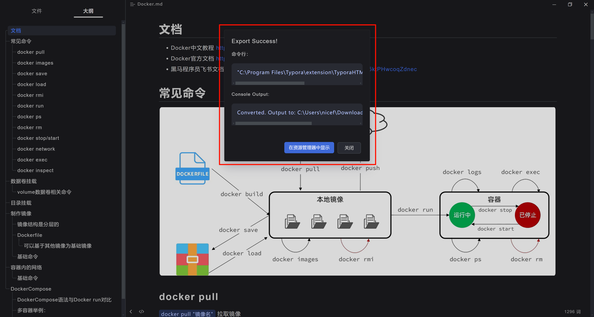

**使用其他语言阅读 | Read this in other languages: [English](README_en.md), [中文](README.md).**


这是一个搭配**Typora.exe**使用的命令行应用。主要解决的问题是：

- Typora.exe导出的HTML文件如果含有本地图片，图片会存在本地的文件夹内，不会包含在HTML内，导致无法做到单文件分享。

- 由于安全策略的原因，Edge无法成功的把包含本地文件的HTML转换为MHTML文件。

- 此应用可以在Typora.exe导出HTML时自动把**本地**图片转换为Base64格式包含在HTML文件内。
  
  

# 命令行功能：

此应用只有两个命令行命令

## 1. 查看当前软件版本

```bash
C:\Users\username>"C:\Program Files\Typora\extension\TyporaHTMLImgToBase64.exe" -v
v1
```

## 2. 转换HTML文件

```bash
C:\Users\username>"C:\Program Files\Typora\extension\TyporaHTMLImgToBase64.exe" "C:\Users\nicef\Downloads\test\Docker.html"
Converted. Output to: C:\Users\username\Downloads\test\Docker - Base64.html
```


# 如何绑定Typora.exe自动转换HTML文件

## 1. 复制`TyporaHTMLImgToBase64.exe`到电脑本地。

我复制到`C:\Program Files\Typora\extension\TyporaHTMLImgToBase64.exe`为例。

## 2. 修改Typora.exe设置，配置导出HTML后自动执行脚本（设置后需重启Typora.exe软件）。


## 3. 展示效果

- 弹出窗口显示脚本运行成功，并显示输出结果。
  

- 文件管理器内"同名 - Base64.html"的就是转换后的THTML文件。
  
