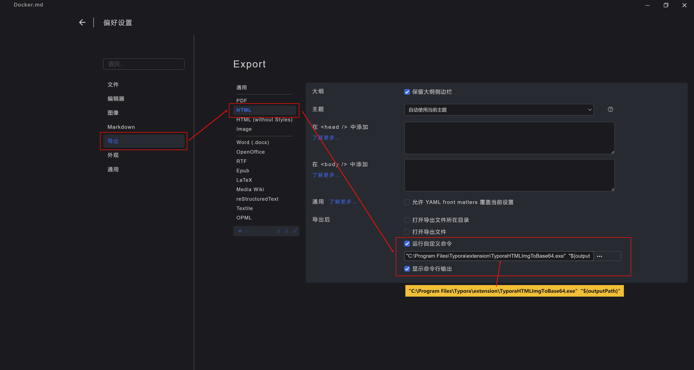
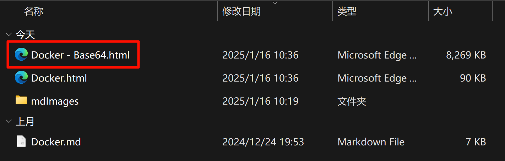

**使用其他语言阅读 | Read this in other languages: [English](README_en.md), [中文](README.md).**


This is a command line application used with **Typora.exe**. The main problems solved are:

- If the HTML file exported by Typora.exe contains a local image, the image will be stored in the folder of the local capital, and will not be included in the HTML, resulting in the failure to share a single file.

- Due to security policies, Edge cannot successfully convert HTML containing local files to MHTML files.

- This application can automatically convert ** local ** images to Base64 format when Typora.exe exports HTML.

# Command line functions:

This application has only two command line commands。

## 1. View the current software version

```bash
C:\Users\username>"C:\Program Files\Typora\extension\TyporaHTMLImgToBase64.exe" -v
v1
```

## 2. Conver HTML file

```bash
C:\Users\username>"C:\Program Files\Typora\extension\TyporaHTMLImgToBase64.exe" "C:\Users\nicef\Downloads\test\Docker.html"
Converted. Output to: C:\Users\username\Downloads\test\Docker - Base64.html
```


# How to bind Typora.exe to automatically convert HTML files?

## 1. Copy the TyporaHTMLImgToBase64.exe` to the local computer.

I copy to `C:\Program Files\Typora\extension\TyporaHTMLImgToBase64.exe` for example.

## 2. Modify the Typora.exe setting. Configure to automatically execute a script after exporting to HTML (the Typora.exe software needs to be restarted after setting).



## 3. Display Result

- A dialog box is displayed indicating that the script is successfully executed and the output result is displayed.
  

- The "eponymous - Base64.html" file in the file manager is the converted THTML file.
  
